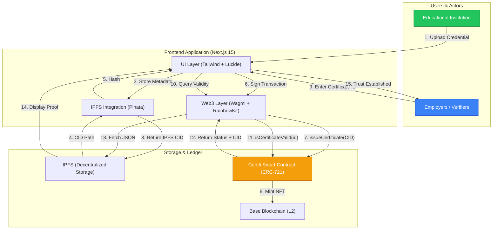

# Certifi - Blockchain-Powered Credential Verification on Base
## Restoring Global Trust in Academic Credentials


> [!IMPORTANT]
> **Certifi Smart Contract is DEPLOYED and LIVE!**  
> **Network**: Base Mainnet  
> **Contract Address**: `0x33A21018CF5Ccf399f98DeDfc29eAa1AbEEF0AAB`

# The Problem
### African academic institutions face a critical trust crisis globally. Employers worldwide struggle to verify African qualifications, leading to:
### Delayed hiring processes due to lengthy verification procedures
### Millions in fraud losses from fake certificates and credentials
### Loss of opportunities for qualified African graduates
### Erosion of trust in African educational institutions

# The Solution
## Certifi is a revolutionary platform built on the **Base network** that restores global trust in academic credentials through:
1. Tamper-Proof Certificates
   Immutable blockchain storage ensures certificates cannot be forged
Cryptographic verification guarantees authenticity
Permanent record of all credential transactions

2. Instant Verification
   
Real-time credential verification in seconds
Global accessibility 24/7
No more waiting for manual verification processes

3. Complete Ecosystem
   Institution registration and management
   Student certificate issuance
   Employer verification tools
   Comprehensive audit trails

# System Architecture



# Premium User Experience
## Certifi features a state-of-the-art interface designed for the next generation of trust:
- **Glassmorphism Design**: High-end translucent cards and navigation elements using `backdrop-blur` and `zinc` shades.
- **Premium Dark Theme**: A refined black-zinc color palette with emerald accents for a "pro" fintech appearance.
- **Micro-Animations**: Fluid motion using `framer-motion` and custom CSS `float` animations.
- **Responsive Architecture**: Fully optimized for all device sizes.

# Tech Stack Highlights
- **Framework**: Next.js 15 (App Router)
- **Styling**: Tailwind CSS + Custom Glassmorphism Utilities
- **Motion**: Framer Motion
- **Web3**: Wagmi & RainbowKit
- **Icons**: Lucide React

# Getting Started
## Prerequisites
- Node.js 18+
- npm or yarn
- MetaMask wallet
- Base Sepolia testnet access

# Installation
```bash
# Clone the repository
git clone https://github.com/dimka90/Certifi.git
cd Certifi/frontend

# Install dependencies
npm install

# Run development server
npm run dev
```

# License
This project is licensed under the MIT License.

## Recent Updates
- **Emergency Pause**: Contract can be paused by admin for safety.
- **Metadata Updates**: Correct typos in issued certificates without revoking.
- **Batch Revocation**: Efficiently revoke multiple credentials in one go.
- **Soulbound Tokens**: Certificates are now non-transferable (bound to student wallets).
- **Batch Issuance**: Institutions can now issue up to 50 certificates in a single transaction.
- **Expiration**: Certificates now support expiration dates and validation checks.
